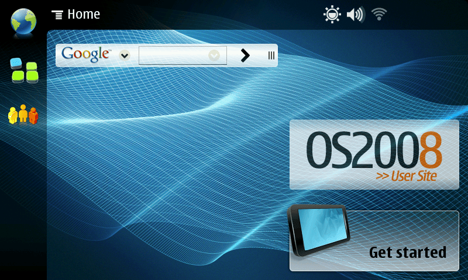

# n810-modern

Modern software on the Nokia N800 and N810, running Maemo 4.1.2 (Diablo).

A cross-compilation environment targeting the device's glibc 2.5 from a current
host, and a full-system emulator running the real firmware so you can work
without hardware.

**Why:** the device still does DNS, sockets and bytes, but cannot complete a
TLS handshake with anything built after roughly 2013. OpenSSL 0.9.8e tops out
at TLS 1.0 with no ECDHE, no AES-GCM, no SNI; modern servers require TLS
1.2/1.3 with ECDHE and an AEAD cipher. No overlap, so the connection dies at
ClientHello. No certificate work fixes that.

This does not make the modern web work — nothing here renders a 2026 site. It
buys package repositories, `git`, mail, IRC, RSS, and anything networked you
write yourself.

## Quickstart

**Docker is required, not a convenience.** The build unpacks 2008 Debian
packages containing hardlinked files, which fails on macOS shared filesystems;
the build tree lives in a Docker volume. See [CAVEATS.md](CAVEATS.md).

On Linux, Docker alone should be enough — untested, see [Tested on](#tested-on).
macOS, which is what this has actually been run on:

```sh
brew install colima docker
colima start --cpu 4 --memory 8 --disk 60
```

Do **not** use Homebrew's QEMU — the `n810` machine was removed in QEMU 9.2,
and `qemu-arm` user-mode does not run on macOS at all. The container has the
right versions.

```sh
tools/build-in-docker.sh
```

Fetches a Diablo sysroot from the community mirrors, cross-compiles OpenSSL
3.5.8 and stunnel 5.80, installs a current CA store, and runs both test suites
against the device's own glibc 2.5 under QEMU — including a real TLS 1.3
handshake. Result: `dist/handshake-diablo-armel.tar.gz`, 5.3 MB, unpacks to
`/opt/handshake` on the device.

| Host | Clean build |
| --- | --- |
| Apple M4, native arm64 container | 1m 30s |
| x86-64, 4 cores, Debian 13 | ~15m (earlier tree, see below) |

Runs native by default; `PLATFORM=linux/amd64` to match a specific build host.

### Tested on

**macOS 26.6.1, Apple M4, colima + Docker.** Specifically:

| | macOS 26.6.1 / M4 | Debian 13 / x86-64 |
| --- | --- | --- |
| `build-in-docker.sh` (cold, empty volume) | ✅ | earlier tree |
| `qemu-smoke.sh`, `qemu-stunnel-test.sh` | ✅ | earlier tree |
| `build-zlib.sh`, `build-curl.sh`, `qemu-curl-test.sh` | ✅ | not run |
| `mk-diablo-emulator.sh`, `emulator-smoke.sh` | ✅ | ✅ |
| `emulator-gui-build.sh` + native window | ✅ | — |
| `emulator-gui.sh` (VNC) | not run | ✅ |

macOS has run everything except the VNC frontend, which is the same image
served differently. "Earlier tree" means it passed on Linux before the zlib,
curl and header-precedence changes, and has not been re-run since.

The one host-specific problem we know about — hardlink extraction failing on
shared filesystems — is macOS-only, and is already worked around. Everything
else ought to be portable. That is an expectation, not a test result.

Windows and WSL: entirely untried.

**PRs welcome for other operating systems.** If you run it somewhere new,
the useful thing to report is the output of `tools/build-in-docker.sh` and your
host, container runtime and architecture — most failures here are silent or
name the wrong cause, so raw output beats a summary.

### Running it in a native window (macOS)

The emulator scripts use VNC because they are written to run anywhere,
including headless. For a real window on macOS you need your own QEMU: the
`n810` machine was removed in **9.2**, and Homebrew ships 11.x, so no packaged
build can run this.

QEMU 9.1.3 is the last release with the machine, and one target builds in
well under a minute:

```sh
curl -O https://download.qemu.org/qemu-9.1.3.tar.xz
tar xf qemu-9.1.3.tar.xz && cd qemu-9.1.3
python3 -m venv /tmp/qemu-py && /tmp/qemu-py/bin/pip install distlib
./configure --target-list=arm-softmmu --enable-cocoa --disable-docs \
            --disable-tools --disable-guest-agent --python=/tmp/qemu-py/bin/python3
make -j$(sysctl -n hw.ncpu)
```

The `distlib` venv is needed because QEMU's build bootstraps its own virtualenv
and current Homebrew Python does not ship it.

The image still has to be built in the container -- `mkfs.jffs2` and `0xFFFF`
are Linux-only -- so copy it out and run it natively:

```sh
docker run --rm -v n810-build:/work -v "$PWD/dist/emulator:/out" ubuntu:24.04 \
  sh -c 'cp /work/emulator/flash-gui.img /work/emulator/unpacked/kernel_* /out/'

./build/qemu-system-arm -M n810 -m 128 \
  -kernel dist/emulator/kernel_* \
  -drive file=dist/emulator/flash-gui.img,format=raw,if=mtd \
  -append "console=ttyS0,115200n8 root=/dev/mtdblock3 rootfstype=jffs2 rw init=/linuxrc" \
  -display cocoa
```

Mouse is the touchscreen, keyboard is the tablet's. Use `flash.img` and
`init=/bin/sh` instead for a shell rather than the desktop.

### The real firmware, no hardware needed



Nokia's final N810 release, on the emulated device: the Hildon desktop at
800x480, the tablet's own resolution. No hardware. This is a `screendump` from
the QEMU monitor, taken about ten minutes after the boot starts.

```sh
tools/mk-diablo-emulator.sh     # fetch and unpack Nokia's final N810 release
tools/emulator-smoke.sh         # run our binaries on the real 2.6.21 kernel
tools/emulator-gui-build.sh     # and, if you want it, the desktop
tools/emulator-gui.sh           # over VNC, loopback, password printed at start
```

`emulator-smoke.sh` answers what static checks and user-mode QEMU cannot:
whether the real kernel serves every syscall the binaries make. It does.

### Customising the desktop

The image above is Nokia's, with the patches the emulator needs and nothing
else. To change what the desktop shows, put your own files in an overlay:

```sh
cp -a gui-overlay.example gui-overlay
$EDITOR gui-overlay/etc/hildon-desktop/tasknavigator.conf
tools/emulator-gui-build.sh
```

The tree under `gui-overlay/` is the tree of the device, and the build copies
it over the rootfs after every built-in patch. `gui-overlay/overlay.sh`, if
you write one, runs after the copy with the rootfs as its working directory,
for the edits a whole file cannot express.

| | |
| --- | --- |
| `GUI_OVERLAY` | Where the overlay is. Default `gui-overlay`; skipped when absent |
| `KEEP_ROOTFS=1` | Do not refresh the rootfs from `rootfs.stock` first |
| `KEEP_CONTACTS=1` | Keep the contacts button, which the build drops |
| `DEBUG_SHELL=1` | Add a framebuffer diagnostic dump to the boot |

Each build starts from `rootfs.stock`, the untouched extraction, so the image
is the firmware plus your overlay — not the firmware plus every earlier run.
[gui-overlay.example/README.md](gui-overlay.example/README.md) lists the files
that control the menus, the panels and the status bar.

### On the device

```sh
tar xzf handshake-diablo-armel.tar.gz -C /opt
export LD_LIBRARY_PATH=/opt/handshake/lib
/opt/handshake/bin/openssl version -a
```

A stock device has no `openssl` CLI, no `wget`, no `curl` and no Python — only
the `libssl0.9.8` library. Plan how you will get files onto it; USB mass
storage needs nothing installed.

## Status

Four packages in `/opt/handshake`, all alongside the stock libraries rather
than over them:

| | |
| --- | --- |
| OpenSSL | 3.5.8 |
| stunnel | 5.80 |
| zlib | 1.3.2 |
| curl | 8.22.0 |

Both OpenSSL providers load, RSA and EC keygen work, TLS 1.3 to `example.org`
verifies, and an expired certificate is correctly refused. stunnel turns a
plain-HTTP client into a verified TLS 1.3 connection, which is how stock
applications get modern TLS without being rebuilt. curl reports:

```
curl 8.22.0 (arm-unknown-linux-gnueabi) libcurl/8.22.0 OpenSSL/3.5.8 zlib/1.3.2
```

All verified on the real firmware and kernel under emulation.

**Not yet run on physical hardware.** Still hardware-only: real timings, WiFi,
the RTC clock, flash wear.

Next: `git`, then a browser — NetSurf's framebuffer frontend is the only
realistic option, and curl was its hard prerequisite. Then a static apt
repository over plain HTTP with signed packages, because you cannot fetch the
thing that enables HTTPS over HTTPS.

[APPS.md](APPS.md) is the backlog: what can realistically run on this device
and why, checked against the actual firmware rather than the spec sheet.

## Tools

```
build-in-docker.sh      everything below, in a container
setup-host.sh           cross-compiler and prerequisites
mk-sysroot.sh           27 MB Diablo sysroot, checksummed
env.sh                  cross-env: modern GCC -> glibc 2.5
build-openssl.sh        OpenSSL 3.5 LTS for armv6
mk-truststore.sh        current CA store, checksum-verified
build-stunnel.sh        stunnel 5.80 against the above
build-zlib.sh           zlib 1.3.2 (the device's 1.2.3 is too old, and CVE-ridden)
build-curl.sh           curl 8.22.0 against our OpenSSL and zlib
build-openssh.sh        OpenSSH 10.5p1 -- a shell and scp on the device
check-artifact.sh       static checks: will this run on the device
qemu-smoke.sh           run it on the device's own glibc 2.5
qemu-stunnel-test.sh    plain HTTP in, verified TLS 1.3 out
qemu-curl-test.sh       fetch a page; confirm a bad certificate is refused
mk-diablo-emulator.sh   fetch and unpack the real firmware
emulator-smoke.sh       run it on the real 2.6.21 kernel
probe-kernel.sh         ask that kernel what it supports (TUN, audio, iptables)
emulator-gui-build.sh   build an image that reaches the desktop
emulator-gui.sh         boot that, over VNC
fb-autoupdate.c         forces the panel to refresh; built for the guest
device-smoke-test.sh    run this on the tablet itself
```

Three test levels, each catching what the one above cannot:

| | Runs on | Catches |
| --- | --- | --- |
| `check-artifact.sh` | nothing — static | symbol versions, ABI note, IFUNC, NEEDED |
| `qemu-smoke.sh` | device's glibc 2.5, host kernel and network | loading, crypto, real TLS handshakes |
| `emulator-smoke.sh` | real 2.6.21 kernel and userland | whether the kernel serves the syscalls |

## The flags that matter

Cross-compiling for a 2008 device from a 2026 host fails in ways that are
silent on the host and fatal on the device. Handled in `tools/env.sh` and
`tools/build-openssl.sh`.

| Flag | Without it |
| --- | --- |
| `-B$SYSROOT/usr/lib` | Links the host's `crt1.o`, whose ABI note demands Linux 3.2. Device loader refuses: `FATAL: kernel too old`. |
| `-nostdinc -isystem …` | Compiles against the host's glibc headers, which sit ahead of the sysroot even with `--sysroot`. |
| `-U_FILE_OFFSET_BITS -U_TIME_BITS` | Ubuntu enables 64-bit time_t and LFS by default on 32-bit targets. glibc 2.5 predates both. |
| `-fgnu89-inline` | glibc 2.5's `string2.h` uses GNU89 `extern __inline`; GCC's C99 rules emit it everywhere. |
| `-DBROKEN_CLANG_ATOMICS` | GCC calls into `libatomic`, whose entry points are all `IFUNC`. glibc 2.5 predates IFUNC. |

Four of the five exist because the **host** is modern, not because the target
is old.

## Also

- [CAVEATS.md](CAVEATS.md) — failures that do not announce themselves. Read
  this before debugging anything.
- [APPS.md](APPS.md) — what is realistic to port, and what is not.
- [DECISIONS.md](DECISIONS.md) — what the device ships, and why this is built
  the way it is.
- [BUILDLOG.md](BUILDLOG.md) — the long form: every failure, with the logs.

Prior work: [Maemo In Qemu](https://www.slideshare.net/hrw/maemo-in-qemu-presentation),
[ssvb/linux-n810](https://github.com/ssvb/linux-n810),
[Diablo Community Project](https://wiki.maemo.org/Diablo_Community_Project).

MIT licensed. Nokia's firmware is downloaded from community mirrors at build
time, not redistributed here.
